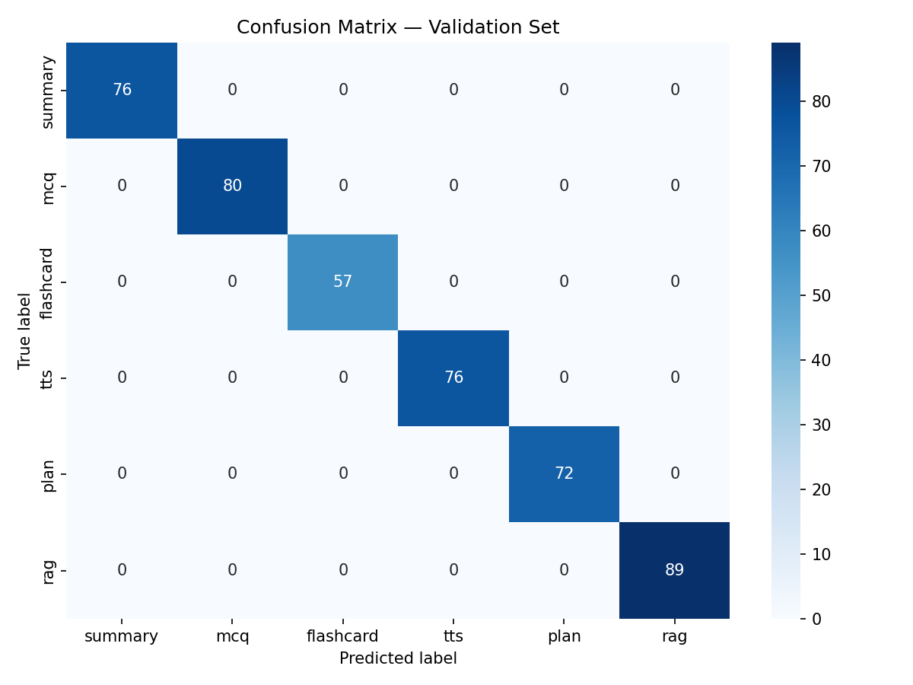

# GLSClass Orchestrator

A lightweight Python microservice that classifies natural-language user requests
and routes them to the correct downstream service using a **fine-tuned MiniLM-L6**
intent classifier (runs fully locally — no API key, no internet required after setup).

---

## Table of Contents

1. [Architecture](#architecture)
2. [Project Structure](#project-structure)
3. [Service Classes](#service-classes)
4. [Model Performance](#model-performance)
5. [API Reference](#api-reference)
6. [Response Flow](#response-flow)
7. [Running the Service](#running-the-service)
8. [Environment Variables](#environment-variables)
9. [Managing Classes](#managing-classes)
10. [Retraining the Model](#retraining-the-model)

---

## Architecture

```
User / Frontend
      │
      ▼
 Your Backend
      │  POST /api/v1/classify
      ▼
┌──────────────────────────────────────────┐
│         ActionExtraction Orchestrator    │
│                                          │
│                                          │
│  1. MiniLM-L6      (fine-tuned, local)   │
│                                          │
│  2. Always returns HTTP 200              │
└──────────────────┬───────────────────────┘
                   │
                   ▼
   {
     detected_class,       ← e.g. "summary"
     confidence,           ← 0.0 – 1.0
     required_fields,      ← what the service needs
     downstream_url        ← where to forward the request
   }
                   │
                   ▼
   Your backend collects any missing fields from the user,
   then forwards to downstream_url
```

**Classes are stored in SQLite** — add, update, or delete at runtime with no restart.

---

## Project Structure

```
classifier-service/
├── app/
│   ├── core/config.py          ← all settings (reads .env)
│   ├── models/schemas.py       ← Pydantic request/response models
│   ├── services/
│   │   ├── classifier.py       ← keyword check + MiniLM inference
│   │   ├── registry.py         ← SQLite-backed class registry
│   │   └── url_resolver.py     ← maps class name → downstream URL
│   ├── routers/
│   │   ├── classify.py         ← POST /api/v1/classify
│   │   └── classes.py          ← admin CRUD endpoints
│   └── main.py
├── training/
│   ├── dataset/                ← your *_dataset.json files
│   │   ├── summary_dataset.json
│   │   ├── mcq_dataset.json
│   │   └── ...
│   ├── model/                  ← fine-tuned model output
│   │   ├── config.json
│   │   ├── model.safetensors
│   │   ├── tokenizer files
│   │   ├── label_map.json
│   │   └── confusion_matrix.png
│   └── finetune_minilm.ipynb   ← training notebook
├── data/                       ← SQLite DB (auto-created)
├── .env
└── requirements.txt
```

---

## Service Classes

| Class | Required Fields | Optional Fields |
|---|---|---|
| `summary` | `lecture` | — |
| `mcq` | `lecture` | `num_questions` |
| `flashcard` | `lecture` | `num_cards` |
| `tts` | `lecture` | `voice`, `speed` |
| `plan` | `start_date`, `end_date` | `topics`, `hours_per_day` |
| `rag` | `query` | — |

---

## Model Performance

The fine-tuned `MiniLM-L6` classifier was evaluated on a held-out validation set
of **450 samples** (15% of the full dataset).

### Classification Report

```
                precision    recall  f1-score   support

     summary       1.00      1.00      1.00        76
         mcq       1.00      1.00      1.00        80
   flashcard       1.00      1.00      1.00        57
         tts       1.00      1.00      1.00        76
        plan       1.00      1.00      1.00        72
         rag       1.00      1.00      1.00        89

    accuracy                           1.00       450
   macro avg       1.00      1.00      1.00       450
weighted avg       1.00      1.00      1.00       450
```

### Confusion Matrix



Zero misclassifications across all 6 classes on the validation set.

---

## API Reference

### `POST /api/v1/classify`

Classify a user request. **Always returns HTTP 200.**

#### Request

```json
{
  "user_message": "can you summarize lecture 3?",
  "context": {
    "lecture": "In this lecture we covered..."
  }
}
```

| Field | Type | Required | Description |
|---|---|---|---|
| `user_message` | string | ✅ | Raw user input |
| `context` | object | ❌ | Data already collected — lecture text, dates, etc. |

#### Response `200 OK`

```json
{
  "status": "classified",
  "detected_class": "summary",
  "confidence": 0.9998,
  "required_fields": ["lecture"],
  "optional_fields": [],
  "downstream_url": "http://summary-service:8001"
}
```


| Code | Meaning |
|---|---|
| `200` | Always returned — inspect `required_fields` vs `extracted_data` |
| `500` | Internal model error |

---

### `POST /api/v1/classes`

Register a new class or update an existing one (no restart needed).

```json
{
  "name": "translation",
  "required_fields": ["lecture", "target_language"],
  "optional_fields": ["formality"]
}
```

#### Response `200 OK`

```json
{
  "success": true,
  "message": "Class 'translation' saved.",
  "classes": ["flashcard", "mcq", "plan", "rag", "summary", "translation", "tts"]
}
```

---

### `GET /api/v1/classes`

List all registered classes.

---

### `DELETE /api/v1/classes/{name}`

Delete a class by name. Returns `404` if not found.

---

### `POST /api/v1/classes/reset`

Drop all classes and restore the 6 built-in defaults.
Useful when `required_fields` get out of sync.

---

### `GET /health`

```json
{ "status": "ok", "version": "1.0.0" }
```


---

## Running the Service

### Prerequisites

- Python 3.12+
- Fine-tuned model in `training/model/` (run the notebook first)

### Setup & start

```bash
cd ActionExtraction

# Create virtual environment
python -m venv .venv
source .venv/bin/activate      # Windows: .venv\Scripts\activate

# Install dependencies
pip install -r requirements.txt

# Start
uvicorn app.main:app --host 0.0.0.0 --port 8000 --reload
```

Interactive docs: **http://localhost:8000/docs**

---

## Environment Variables

| Variable | Default | Description |
|---|---|---|
| `PORT` | `8000` | Server port |
| `HOST` | `0.0.0.0` | Bind address |
| `LOG_LEVEL` | `info` | `debug` / `info` / `warning` / `error` |
| `CLASSIFIER_MODEL` | `training/model` | Path to fine-tuned model folder |
| `CLASSIFIER_DEVICE` | `cpu` | `cpu` / `cuda:0` / `mps` |
| `CLASSIFIER_MAX_LENGTH` | `128` | Token length (must match training) |
| `SUMMARY_SERVICE_URL` | `http://summary-service:8001` | Downstream URL |
| `MCQ_SERVICE_URL` | `http://mcq-service:8002` | Downstream URL |
| `FLASHCARD_SERVICE_URL` | `http://flashcard-service:8003` | Downstream URL |
| `TTS_SERVICE_URL` | `http://tts-service:8004` | Downstream URL |
| `PLAN_SERVICE_URL` | `http://plan-service:8005` | Downstream URL |
| `RAG_SERVICE_URL` | `http://rag-service:8006` | Downstream URL |

---

## Managing Classes

Classes are stored in `data/classes.db` (SQLite) and persist across restarts.

### Add a new class at runtime

```bash
curl -X POST http://localhost:8000/api/v1/classes \
  -H "Content-Type: application/json" \
  -d '{
    "name": "translation",
    "required_fields": ["lecture", "target_language"],
    "optional_fields": []
  }'
```

> **Note:** Adding a new class at runtime updates the routing logic immediately,
> but the MiniLM classifier won't recognise the new intent until the model
> is retrained with examples of the new class. Until then, keyword-based
> routing or manual context passing can cover the new class.

### Reset to defaults

```bash
curl -X POST http://localhost:8000/api/v1/classes/reset
```

### Add the downstream URL for a new class

1. Add to `.env`:  `TRANSLATION_SERVICE_URL=http://translation-service:8007`
2. Add to `app/core/config.py` Settings
3. Add to `app/services/url_resolver.py` `_URL_MAP`
4. Restart the server

---

## Retraining the Model

To add new classes or improve accuracy:

1. Add training samples to `training/dataset/<name>_dataset.json`
   (one JSON per line: `{"text": "...", "label": "summary"}`)
2. Update `LABELS` in the notebook config cell if adding a new class
3. Open `training/finetune_minilm.ipynb` and run all cells
4. New model saved to `training/model/`
5. Restart the server — it picks up the new model automatically
